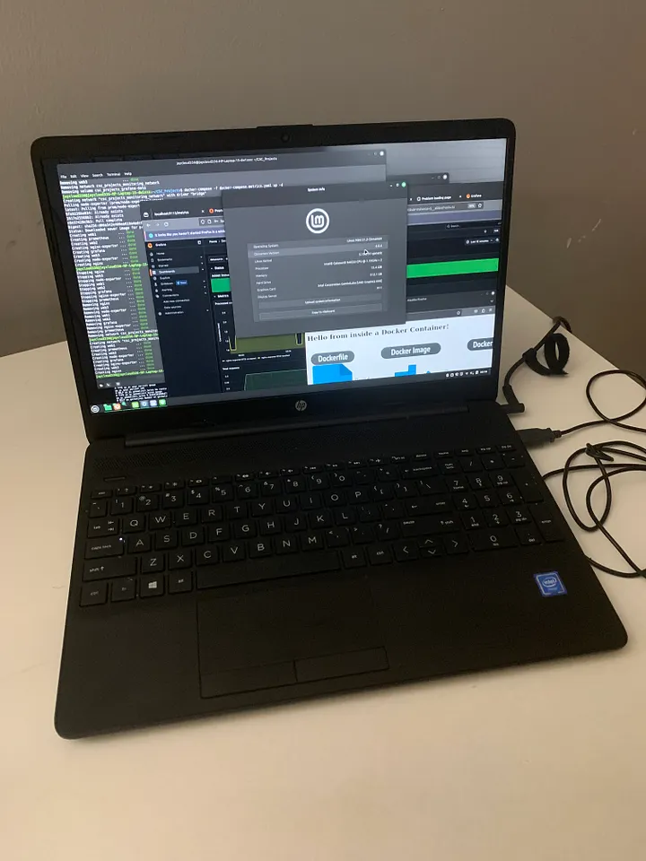
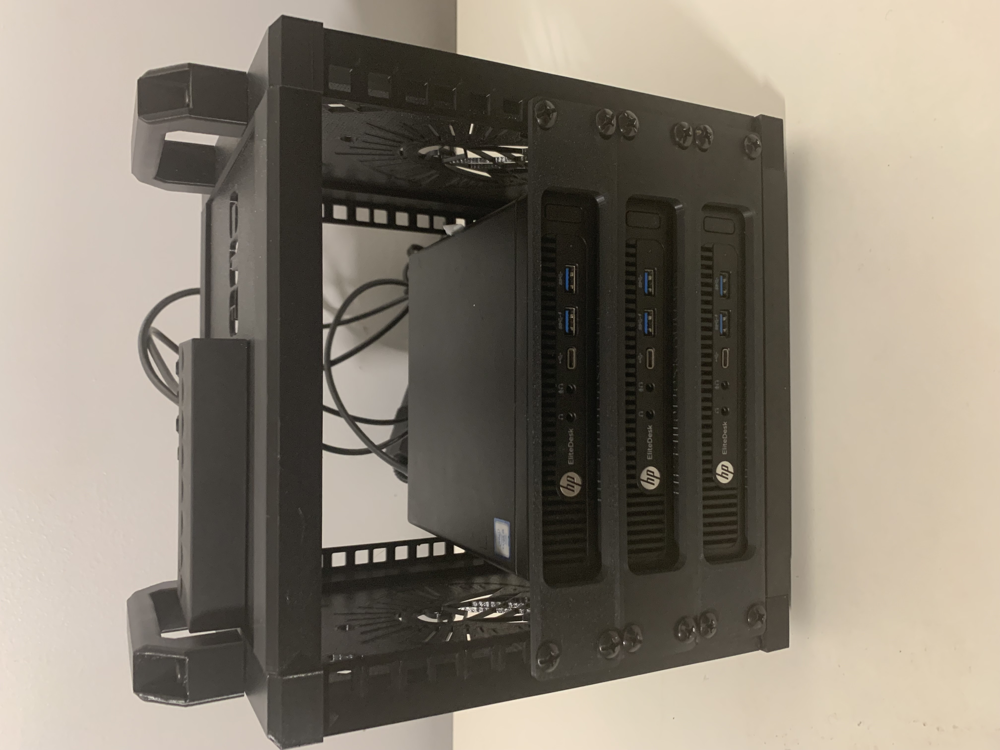
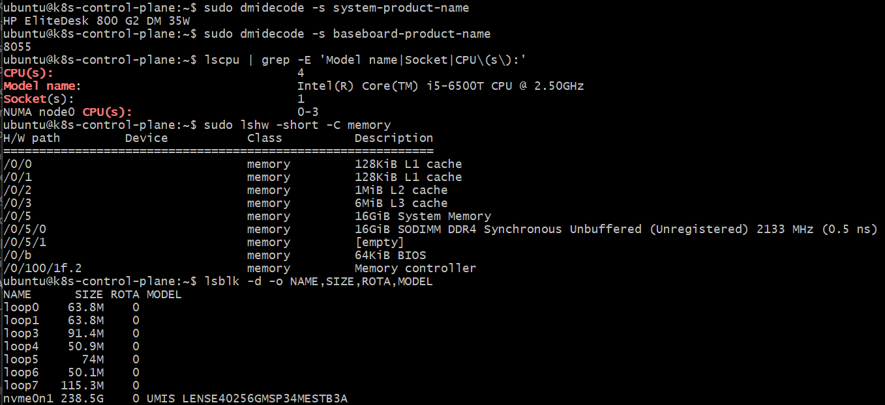
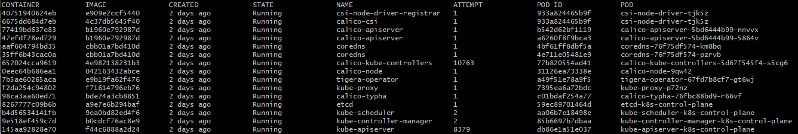

# The "Pod Lab"
### *The evolution of my home lab*

A bare-metal, three-node Kubernetes cluster built with `kubeadm` on used enterprise thin clients — for about **$250–375**. This repo is the build guide, the mistakes, and the journal: the command list *and* where it actually bites you.

If you've hit the ceiling on Docker Desktop or exam sandboxes, or you're tired of being told "just use k3s" when you want to touch the real layers — this is for you.

It started with three HP EliteDesks and a switch on a shelf, no rack, no case, just bare little boxes wired together and humming. It didn't come together smoothly the first time — and that struggle is exactly what I've written down here.

## What's in here

- Step-by-step `kubeadm` build (v1.29.15, Calico, local-path)
- Hardware BOM — real cluster, used gear, ~$250–375
- Updates journal — outages, recovery, evolution

## Why this lab exists

My earlier home labs were humbler: used HP laptops running whatever Linux distro I felt like that month, and a single-node Docker Desktop "cluster" when I wanted something that at least resembled Kubernetes. Those were fine for learning the basics, but each one hit a ceiling. The moment I tried to do anything that looked like a real production setup, the abstractions got in the way.


The clearest example is exposing an application with a `LoadBalancer` service. On Docker Desktop you're running a cluster inside a VM inside your machine, and the moment you ask for a real `LoadBalancer` you hit a wall the abstraction won't let you through. The same kind of ceiling shows up in the browser-based exam sandboxes — wonderful for drilling, but they hold you back the second you want to build something real. And the common advice in nearly every book and course — "just use k3s" — is good advice for good reasons, but k3s quietly abstracts away the very pieces I wanted to get my hands dirty with.

So I made a deliberate choice: full upstream Kubernetes, bootstrapped with `kubeadm`, on real bare metal. Not because it's easier — it absolutely is not — but because it exposes every layer. The control plane, etcd, the container runtime, the CNI, the networking guts, the certificate machinery. All of it out in the open where I can break it and fix it. The friction *is* the feature.

That decision paid off in a few concrete ways:

This cluster became the environment where I studied for my Kubernetes certifications. Drilling on a cluster you built yourself — one you've already broken and repaired a dozen times — teaches you things no practice question can.

It's also my personal and professional proving ground. When I want to learn a new skill or test a hypothesis that's relevant to my job, I try it here first. I prove the theory and break things safely at home before I'd ever attempt them on a real cluster at work. The blast radius is my own hardware and nothing more. To be explicit about it: *nothing proprietary from work ever touches this lab.* It's for transferable skills and general technique, not for replicating anything confidential.

I call this a lab that *simulates* production — not a "production-grade" cluster. That distinction matters. It runs real Kubernetes on real hardware and rehearses real enterprise situations, but it doesn't yet have monitoring, backup and disaster recovery, or a highly-available control plane. Those are on the roadmap. I'd rather describe it honestly than reach for a buzzword it hasn't earned.

And while this was hard to build, it is **not** on par with Kelsey Hightower's *Kubernetes the Hard Way*. That phrase means something specific: hand-installing and wiring every component individually — etcd, the API server, controller-manager, scheduler, certificates — with no bootstrapping tool at all. `kubeadm` actually automates a good chunk of that. So on the spectrum from **fully manual (the Hard Way) → kubeadm → k3s → managed**, this build sits at `kubeadm`: meaningfully harder and more instructive than k3s, but not the fully hand-rolled extreme. Credit where it's due.

---

## Hardware

### The thesis: *a real cluster without a real budget*

One of the quiet points I want this repo to make is that you do **not** need to spend a lot of money to build a legitimate, production-shaped Kubernetes cluster. The whole three-node lab was assembled from used enterprise gear for roughly **$250–375 all in** , and it runs full upstream Kubernetes with room to spare. People assume a "serious" home lab means a rack of new hardware or a fat cloud bill. It doesn't. It means buying the right used gear and knowing what to look for.

### Why used enterprise thin clients (*and not Pis, and not new*)

I came into this from a lineage of used-laptop labs, so buying used again was natural — but this time I wanted something closer to an actual server, and I weighed a few options:

**Raspberry Pis** are often the default home-lab suggestion, and I passed on them deliberately. I wanted **x86_64**, not ARM, so the environment matches the real servers I'd hit at work and on the exams. I wanted **real SSD storage**, not an SD card that wears out and corrupts under a cluster's constant small writes. And I wanted enough **RAM headroom** to run a genuine control plane plus workloads without babying it. By the time you add a decent Pi, a quality SD card or SSD hat, a case, and a PSU, the "cheap" Pi cluster isn't as cheap as it looks — and you still don't have x86.

**New mini PCs** would've solved the architecture problem but blown the budget thesis. There was no reason to pay new-hardware prices for a lab whose entire point is to be broken and rebuilt.

**Used enterprise thin clients** hit every requirement at once: x86_64, proper storage, upgradeable RAM, and dirt-cheap because businesses offload them by the pallet on their refresh cycles. That corporate-surplus flood is exactly what makes them such a bargain — you're buying gear built for reliability, priced like scrap.

### Sourcing: *The eBay hunt*

I sourced the nodes on **eBay**, which is the sweet spot for corporate-surplus small-form-factor machines. A few things I learned to look for, which I'd pass on to anyone doing the same:

- **Buy the same model across all nodes.** Identical hardware means identical setup — one process, one interface name (`eno1`), no per-node surprises. Mixed hardware is how you end up debugging why one worker behaves differently from the others.
- **Confirm RAM and storage are actually included.** Surplus listings sometimes ship with the drive pulled (data-wipe policies) or minimal RAM. Read the spec line, not just the title.
- **Look for multi-unit "lot" listings.** Buying three at once from a single refurbisher is usually cheaper per unit and guarantees they're identical.
- **A "T" suffix CPU is a feature, not a downgrade** — more on that below.
- **Cosmetic grade doesn't matter** for a lab. "Scratch and dent" units are cheaper and run identically.

### The nodes: HP EliteDesk 800 G2 Mini

I settled on the **HP EliteDesk 800 G2 Mini** — a "thin-client" desktop-mini machine that's plentiful, cheap, and far more capable than its size suggests. Three of them, at roughly **$85–$95**.

| Component | Spec | Why it works for a lab |
|-----------|------|------------------------|
| CPU | Intel Core **i5-6500T** (4 cores, ~2.5GHz base) | The **"T" = low-power** variant (~35W TDP). It runs cool and quiet, sips electricity, and for an always-on 24/7 cluster that matters more than raw clock speed. Four real cores is plenty to run the control plane on one node and schedule workloads on the others. |
| RAM | **16GB** DDR4 (per node) | My floor, not a compromise. 16GB gives the control-plane node breathing room for etcd + the API server + controllers, and leaves the workers real capacity for pods. The 800 G2 Mini takes DDR4 SO-DIMMs and can go higher later if I need it. |
| Storage | **240GB SSD** (per node) | An SSD is non-negotiable — Kubernetes and etcd do constant small writes, and a spinning disk or an SD card would choke on that. 240GB is ample for the OS, images, and lab workloads. 
| Network | Single gigabit NIC (`eno1`) | One wired gigabit port per node is all a lab this size needs. No bonding, no dual-NIC complexity — just plug into the switch. |
| Form factor | 1L Desktop Mini | Three of them take up almost no space, draw little power, and — eventually — fit neatly into a 3D-printed cluster case (see the Updates journal). |


### The rest of the kit

- **Switch:** an unmanaged gigabit switch tying the three nodes together and up to the router. `<make/model — TBD>` (estimate: a basic 5-port unmanaged switch, ~$20–30).
- **Router:** an ISP-provided Wi-Fi router, gateway `192.168.86.1` — the nodes get internet from it but, by design, it does no Kubernetes routing (see the Calico/BGP note in the build).
- **Management:** a ThinkPad X1 Carbon as the daily-driver control point, over SSH and `kubectl`. Not part of the cluster — just how I drive it.
- **Later additions:** the 3D-printed cluster case, a new switch, and updated networking hardware came in a later evolution — documented as its own Updates entry.

**Rough bill of materials (estimated):**

| Item | Qty | Est. unit | Est. total |
|------|-----|-----------|------------|
| HP EliteDesk 800 G2 Mini (i5-6500T, 16GB, 240GB SSD) | 3 | ~$85–95 | ~$275–285 |
| Unmanaged gigabit switch | 1 | ~$20–30 | ~$20–30 |
| Ethernet cables | 3 | ~$3–5 | ~$10–15 |
| **Total** | | | **~$250–375** |

For the price of a single mid-range GPU, the whole cluster — three real x86 nodes running full Kubernetes — was on my shelf. That's the point.

### Cluster specifications

| Role | Hostname | IP | Interface | Hardware |
|------|----------|-----|-----------|----------|
| Control Plane | `k8s-control-plane` | `192.168.86.101` | `eno1` | HP EliteDesk 800 G2 Mini — i5-6500T, 16GB, 240GB SSD |
| Worker 1 | `k8s-worker-01` | `192.168.86.102` | `eno1` | HP EliteDesk 800 G2 Mini — i5-6500T, 16GB, 240GB SSD |
| Worker 2 | `k8s-worker-02` | `192.168.86.103` | `eno1` | HP EliteDesk 800 G2 Mini — i5-6500T, 16GB, 240GB SSD |
| Management | ThinkPad X1 Carbon | — | — | Daily driver; `kubectl` / SSH control point |

The nodes connect through the switch to the ISP Wi-Fi router (gateway `192.168.86.1`).


---

## Software stack

| Layer | Choice | Notes |
|-------|--------|-------|
| OS | Ubuntu Server 22.04.5 LTS | Static IPs, all three nodes |
| Bootstrap | `kubeadm` v1.29.15 | Full control-plane build |
| Runtime | `containerd` | `SystemdCgroup = true` |
| CNI | Calico (Tigera operator) v3.29.3 | BGP disabled, `/24` pod CIDR, VXLANCrossSubnet |
| Storage | local-path-provisioner | Default StorageClass |
| Access | SSH keys + merged kubeconfig | Managed from the ThinkPad |

---

## Build process

Ordered stages. Node prep runs on **all three nodes**; the control-plane steps run **only** on `k8s-control-plane`. Real manifests referenced below live under `manifests/`.

### Stage 1 — OS install and static networking

Ubuntu Server 22.04.5 on each node, installed from a USB flash drive boot disk, going through the step-by-step installer with a keyboard, monitor, and mouse connected directly to each machine in turn. No SSH yet at this point — that comes in Stage 2, once the OS is up and networked.

The part that got me the first time was the installer's network screen. It splits the address and the subnet into separate fields, and it won't let you type a slash in the Address field — so the plain IP (`192.168.86.101`) goes in Address, and the CIDR (`192.168.86.0/24`) goes in Subnet. I fought that for a while before it clicked. The other thing that looks alarming but isn't: the interface reads "not connected" all through the install and only comes up on first boot. I nearly tore the whole thing down thinking I'd misconfigured the network, when in reality it was working fine and just hadn't applied yet. Gateway `192.168.86.1`, DNS `8.8.8.8,8.8.4.4`, interface `eno1`.

### Stage 2 — Management access (SSH keys)

```bash
# On the control plane
ssh-keygen -t ed25519 -C "ThinkPad X1 Carbon to homelab"

# Push the key out to the workers
ssh-copy-id ubuntu@192.168.86.102
ssh-copy-id ubuntu@192.168.86.103
```

Something that confused me early: SSH key trust is one-directional. Setting up the control plane to reach the workers passwordlessly does **not** get me back the other way — the workers still prompt for a password into the control plane unless I distribute keys there too. That's fine for how I actually work (everything is driven from the control plane and the ThinkPad), so I left it one-way on purpose. But I definitely expected it to be bidirectional the first time and spent a minute puzzled about why it "half worked."

### Stage 3 — Node preparation (all nodes)

Container runtime:

```bash
sudo apt update && sudo apt upgrade -y
sudo apt install -y containerd
sudo mkdir -p /etc/containerd
containerd config default | sudo tee /etc/containerd/config.toml
sudo sed -i 's/SystemdCgroup = false/SystemdCgroup = true/g' /etc/containerd/config.toml
sudo systemctl restart containerd
sudo systemctl enable containerd
```

That `SystemdCgroup = true` edit is not optional and it's easy to skip. If you leave it false, kubelet and containerd end up using different cgroup drivers and the whole thing gets subtly, miserably unstable in a way that's hard to trace back to this one line. I know because I skipped it once.

Disable swap — Kubernetes wants predictable memory, and swap breaks the scheduler's guarantees.

Think of "swap" as disk space your OS uses as overflow when RAM fills up — treating part of the disk like slow, temporary extra memory. Normally that's a helpful safety net. But swap is unpredictable by design: the kernel decides on its own when to shuffle stuff between fast RAM and slow disk, and how much. Kubernetes needs to make hard, exact guarantees about how much memory each pod gets — if the scheduler thinks a node has room for one more pod based on RAM, but the OS is secretly relying on swap to make ends meet, that guarantee falls apart. So Kubernetes doesn't try to cooperate with swap; the kubelet just flatly refuses to start at all if it detects swap is on.

```bash
sudo swapoff -a
sudo sed -i '/ swap / s/^\(.*\)$/#\1/g' /etc/fstab
```

The `swapoff -a` turns it off *now*; the `sed` line comments swap out of `/etc/fstab` so it stays off across reboots. Miss the second part, or have it get undone somehow, and swap silently comes back the next time the node restarts — the kubelet then refuses to start with a flat `running with swap on is not supported, please disable swap!` error. That's exactly what happened during the recovery documented in the Updates journal: after an extended planned outage, a reboot re-enabled swap on all three nodes, and it turned out to be the actual cluster-killer — nothing was reachable on the apiserver port not because of networking, but because the kubelet launching it wouldn't even start. Do both steps here, and don't assume "I did it once" means it's permanent.

Kernel modules and sysctl:

```bash
cat <<EOF | sudo tee /etc/modules-load.d/k8s.conf
overlay
br_netfilter
EOF

sudo modprobe overlay
sudo modprobe br_netfilter

cat <<EOF | sudo tee /etc/sysctl.d/k8s.conf
net.bridge.bridge-nf-call-iptables  = 1
net.bridge.bridge-nf-call-ip6tables = 1
net.ipv4.ip_forward                 = 1
EOF

sudo sysctl --system
```

These are the settings that let bridged pod traffic actually traverse iptables and let packets forward between nodes. Skip them and pods come up but can't talk across nodes, which presents as a maddening "networking is broken but nothing is obviously wrong" situation.

Install the Kubernetes components:

```bash
sudo apt install -y apt-transport-https ca-certificates curl gpg

curl -fsSL https://pkgs.k8s.io/core:/stable:/v1.29/deb/Release.key | \
  sudo gpg --dearmor -o /etc/apt/keyrings/kubernetes-apt-keyring.gpg

echo 'deb [signed-by=/etc/apt/keyrings/kubernetes-apt-keyring.gpg] https://pkgs.k8s.io/core:/stable:/v1.29/deb/ /' | \
  sudo tee /etc/apt/sources.list.d/kubernetes.list

sudo apt update
sudo apt install -y kubelet kubeadm kubectl
sudo apt-mark hold kubelet kubeadm kubectl
sudo systemctl enable --now kubelet
```

This one genuinely stumped me. I added the GPG key, ran `apt install kubelet kubeadm kubectl`, and apt swore the packages didn't exist and tried to push me toward snap. The missing piece: the repository `.list` file has to be written **before** `apt update`. The key alone isn't enough — apt has no idea where to look until the source list exists. Once I added `/etc/apt/sources.list.d/kubernetes.list` and re-ran `apt update`, the packages appeared immediately. Also worth knowing so you don't panic: `kubelet` will sit in a crash-loop until the cluster is actually initialized. That's expected, not a failure.

#### Stage 4 — Initialize the control plane (control plane only)

```bash
sudo kubeadm init \
  --apiserver-advertise-address=192.168.86.101 \
  --pod-network-cidr=192.168.0.0/24 \
  --service-cidr=10.96.0.0/12 \
  --node-name=$(hostname)

mkdir -p $HOME/.kube
sudo cp -i /etc/kubernetes/admin.conf $HOME/.kube/config
sudo chown $(id -u):$(id -g) $HOME/.kube/config

kubeadm token create --print-join-command > ~/join-command.txt
```

I went with a `/24` pod CIDR rather than the more commonly-documented `/16`, and I stand by it: 256 pod addresses (~64 per node) is plenty for three nodes. The `/16` you see everywhere exists to plan for massive scale I'll never have here. Right-sizing was deliberate, not a shortcut. One thing that will make you second-guess yourself: right after `init`, the nodes report `NotReady`. That's correct — there's no CNI yet. Don't go chasing it.

### Stage 5 — Install the Calico CNI (control plane only)

Rather than blindly applying the upstream manifest, I download it, edit it, and *then* apply — so I know exactly what I'm putting on the cluster. The edited file lives at `manifests/calico/custom-resources.yaml`.

```bash
wget https://raw.githubusercontent.com/projectcalico/calico/v3.29.3/manifests/custom-resources.yaml
vi custom-resources.yaml
```

The two edits that matter — disable BGP, and set the pod CIDR to my `/24`:

```yaml
apiVersion: operator.tigera.io/v1
kind: Installation
metadata:
  name: default
spec:
  calicoNetwork:
    bgp: Disabled
    ipPools:
    - blockSize: 26
      cidr: 192.168.0.0/24
      encapsulation: VXLANCrossSubnet
      natOutgoing: Enabled
      nodeSelector: all()
```

```bash
kubectl create -f https://raw.githubusercontent.com/projectcalico/calico/v3.29.3/manifests/tigera-operator.yaml
kubectl apply -f custom-resources.yaml
kubectl get pods -n calico-system --watch
```

I disabled BGP on purpose. With BGP on, Calico wants to peer with the router and advertise pod routes to it — and I do not want my home router involved in routing individual pod networks. I want the router to do exactly one job: hand internet to the nodes. Kubernetes handles pod networking internally over a VXLAN overlay, and the router stays blissfully unaware. The other thing worth internalizing: I only apply Calico on the control plane. I do **not** install it on the workers by hand. Kubernetes ships it out to every node as a DaemonSet automatically. It took me a beat to trust that the workers would "get" their networking without me touching them — but that's exactly how it's supposed to work.

### Stage 6 — Join the workers (worker nodes)

```bash
# On the control plane, print the join command
cat ~/join-command.txt

# On each worker, run the printed command with sudo
sudo kubeadm join 192.168.86.101:6443 --token <token> \
  --discovery-token-ca-cert-hash sha256:<hash>
```

If too much time passes between `init` and joining the workers, the token expires and the join fails with an auth error that looks scarier than it is. The fix is just to mint a fresh one on the control plane: `kubeadm token create --print-join-command`.

### Stage 7 — Storage

```bash
kubectl apply -f https://raw.githubusercontent.com/rancher/local-path-provisioner/v0.0.26/deploy/local-path-storage.yaml
kubectl patch storageclass local-path \
  -p '{"metadata": {"annotations":{"storageclass.kubernetes.io/is-default-class":"true"}}}'
kubectl get storageclass
```

The cluster runs fine with no storage class at all. I confirmed that early when `kubectl get storageclass` returned nothing and everything still worked. But nothing can request a PersistentVolume until a provisioner exists, so I added local-path and marked it default with that patch. The `(default)` tag showing up next to it in `get storageclass` is how you know the annotation took.

### Stage 8 — Workstation access (ThinkPad)

```bash
scp ubuntu@192.168.86.101:~/.kube/config ~/.kube/config.homelab

KUBECONFIG=~/.kube/config:~/.kube/config.homelab \
  kubectl config view --merge --flatten > ~/.kube/config.merged
mv ~/.kube/config.merged ~/.kube/config

kubectl config use-context kubernetes-admin@kubernetes
```

*A quick note on access here: Stage 2's SSH key only goes one direction — control plane to workers. It doesn't grant the ThinkPad passwordless access back into the control plane, so that `scp` above — and any SSH from the ThinkPad into the control plane — authenticates with the ubuntu account password. Confirmed: this is genuinely password auth every time, not a key I forgot about.*

This is where I lost a genuinely embarrassing amount of time. My `kubectl` on the ThinkPad kept failing to reach the cluster — connection refused, over and over — and I couldn't work out why the cluster was "down" when it plainly wasn't. The cluster was fine. The problem was that Docker Desktop had installed its own kubeconfig and its context was the active one, so every `kubectl` command was aimed at Docker Desktop's dead single-node cluster instead of my home lab. Merging the configs and explicitly switching to `kubernetes-admin@kubernetes` fixed it instantly. Lesson banked hard: when `kubectl` "can't reach the cluster," check `kubectl config current-context` *before* you touch the cluster.

---

## Verification

```bash
kubectl get nodes -o wide          # all three Ready
kubectl get pods -A                # system + Calico pods Running
kubectl get installation default -o yaml
kubectl get storageclass           # local-path (default)

# Smoke test — pods should spread across the workers
kubectl create deployment nginx-test --image=nginx:1.25
kubectl scale deployment nginx-test --replicas=3
kubectl get pods -o wide
kubectl delete deployment nginx-test
```



---

## Security & what's intentionally not published

This is a security-focused repo, so it's worth stating plainly what is deliberately kept out of it:

- **No secrets, ever.** Kubeconfigs, `admin.conf`, cluster certificates, private SSH keys, and the join token / cert hash are never committed. The `.gitignore` blocks them by pattern, but the discipline is the real safeguard — I don't `git add -f` them.
- **The private IPs (`192.168.86.x`) are RFC 1918 addresses.** They're only meaningful inside my LAN and aren't routable from the internet, so publishing them exposes nothing actionable.
- **Hardware identifiers (MAC addresses) are omitted** — there's no reason to publish them.
- **Version pinning is intentional.** The exact software versions are part of the story, but they're also a reason the cluster upgrade sits on the roadmap: running current versions is good hygiene, especially before anything gets exposed beyond the LAN.

The point: the omissions are deliberate, not accidental.

---

## Roadmap

Planned work, grouped by how near-term it is. Ticked off as it lands, with a matching entry added to the yearly Updates journal.

### Next up
- [ ] **Cluster rebuild to a current version** — rather than grinding through sequential in-place upgrades from v1.29.15 across many minor releases, I'm planning a clean `kubeadm reset` and re-init at a current version. With no valuable workloads to preserve, a rebuild is faster and cleaner than the long chain of staged node-upgrade operations — a deliberate call about when a rebuild beats an upgrade.
- [ ] **Monitoring** — Prometheus / Grafana via the **kube-prometheus-stack** Helm chart (with `metrics-server` as the minimal first step for `kubectl top` and HPA). The main thing standing between "simulates production" and something I'd more honestly call production-grade — and it doubles as the cert-expiry alerting the recovery taught me I need.
- [ ] **MetalLB** — bare-metal `LoadBalancer` support (planned pool `192.168.86.200–210`). This closes the loop on the exact `LoadBalancer` limitation that pushed me toward bare metal in the first place.

### Exploring / experimental
- [ ] **Experiment with 1.36** — Kubernetes 1.36 ("Haru," the first release of 2026) is out, and it's tempting for security reasons — notably User Namespaces reaching GA, which is squarely relevant to the CKS material this lab is built around. I likely won't make it the cluster's main version right away, but I want to experiment with it, probably in a throwaway sandbox, before deciding whether it earns a place in the real rebuild.
- [ ] **Talos exploration** — evaluate Talos Linux as an immutable, API-driven OS on a future rebuild.

### Later
- [ ] **ArgoCD / GitOps** — declarative, Git-driven delivery.
- [ ] **Ingress + TLS** — an ingress controller with cert-manager.

---

## Updates

A dated journal of the lab's evolution, grouped by year (newest first).

### [2026 →](docs/updates/2026.md)
- **2026-08 — CKS** — passed the security specialist exam, alongside the recovery below.
- **2026-08 — The 3D-printed cluster case** — gave the three nodes a proper 5U rack.
- **2026-08 — Recovery from an extended outage** — diagnosed a four-layer cascading failure bottom-up and hardened against recurrence. The best troubleshooting story the lab has produced.
- **2026-06 — CKAD** — the application-developer cert.

### [2025 →](docs/updates/2025.md)
- **2025-10 — KCSA** — cloud native security associate.
- **2025-08 — KCNA** — cloud native associate.
- **2025-08 — Founding build** — the three-node kubeadm cluster came together.
- **2025-07 — CKA** — the administrator cert, earned on the earlier lab that led to this one.

---

## Repository layout

```
.
├── README.md                  # this file — build guide + journal
├── docs/
│   ├── images/                # photos & images
│   └── updates/               # Updates 
├── manifests/
│   ├── calico/                # custom-resources.yaml
│   ├── storage/               # local-path-provisioner customizations
│   ├── metallb/               # MetalLB config
│   └── apps/                  # lab workloads
└── scripts/                   # helper scripts
```