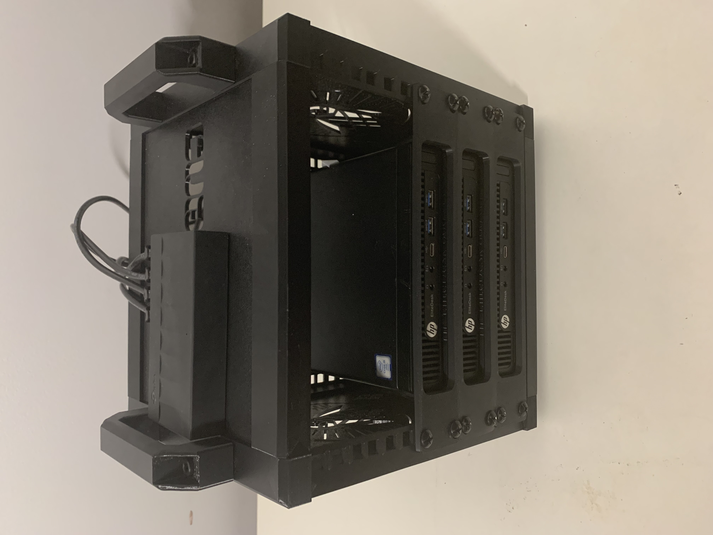
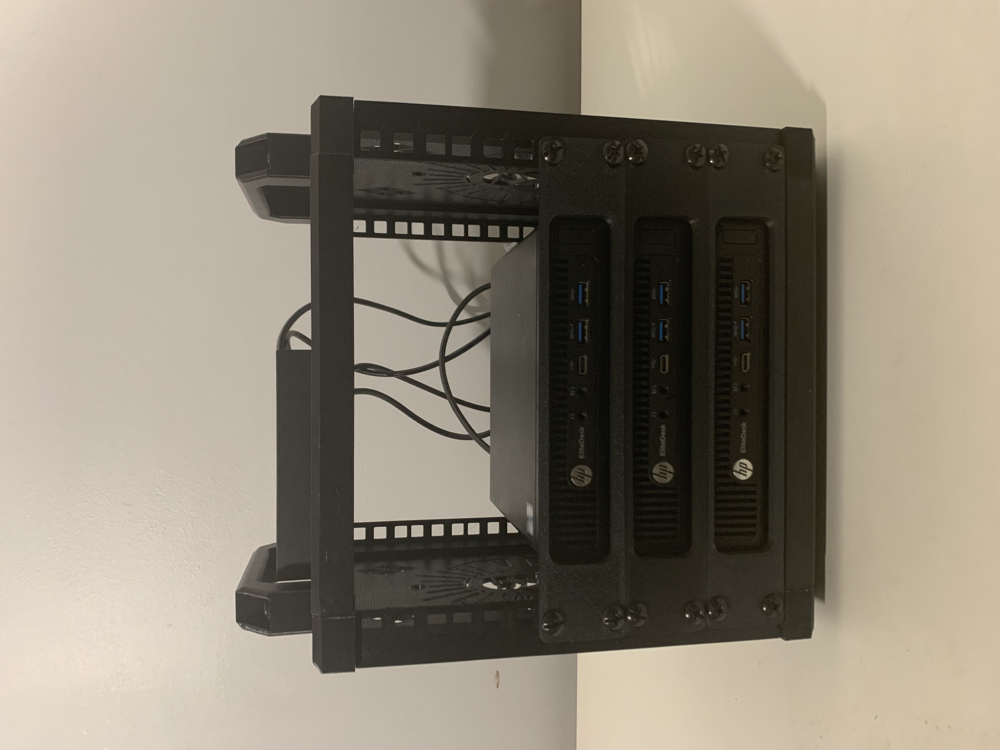
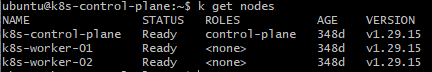

# Updates — 2026

### 2026-08 — CKS (Certified Kubernetes Security Specialist)

Passed the CKS right around the same window as the recovery below — which felt fitting, since the recovery was itself a security-and-hardening exercise. Everything the exam drills (cluster hardening, network policy, minimizing attack surface, certificate management) is exactly the kind of thing this bare-metal cluster lets you practice for real rather than in a sandbox. The last of the five, and the one this lab was most directly built for.

### 2026-08 — The 3D-printed cluster case

For a long time the lab was just bare thin clients and a switch sitting out. Eventually I gave it a proper home. I purchased a 5U 3D-printed Stackable Mini Server Homelab Rack to organize the three nodes, tidy the cabling, and add new networking hardware.






### 2026-08 — Recovery from an extended outage

After a long planned downtime — during which I installed the 3D-printed rack, a new switch, and a new power source — the cluster came back to life fighting. What I logged into wasn't one broken thing; it was four failures stacked on top of each other, and the tell that it was layered was that the error message kept *changing* as I cleared each level: `network is unreachable`, then `connection refused`, then a kubelet crash-loop, then an `x509` certificate mismatch. Each new error meant I'd fixed the layer below it.

**The four stacked failures:**

1. **Physical link was dead.** The NIC reported `NO-CARRIER` on `eno1` — a cable knocked loose during the rack rebuild. Nothing above it can work until the wire is alive.
2. **The cluster certificates had expired.** kubeadm certs have a one-year lifetime, and the cluster had been up (then down) long enough to cross it.
3. **Swap had silently re-enabled.** A reboot during the downtime re-read `/etc/fstab` and turned swap back on. The kubelet refuses to start with swap enabled, so the control plane never came up.
4. **kubeconfig endpoint mismatch.** During diagnosis a temporary secondary IP had crept in, and I initially chased the wrong address before the certificate's SAN told me which IP the cluster was actually built on.

**The recovery — worked bottom-up, physical first, application last. Never skip a layer.**

Layer 1 — restore the link:
```bash
ip a show eno1
# 2: eno1: <NO-CARRIER,BROADCAST,MULTICAST,UP> ... state DOWN
```
`NO-CARRIER` means no signal on the wire. Reseated the ethernet at both the NIC and the switch until the link light came on; the interface flipped to `state UP`.

Layer 2/3 — confirm addressing and reachability:
```bash
ip a show eno1          # confirm an inet address is present
ping -c2 192.168.86.1   # confirm the gateway is reachable
```

Renew the expired certificates:
```bash
sudo kubeadm certs check-expiration   # confirm what expired
sudo kubeadm certs renew all          # renew every control-plane cert
```

Disable swap — the real cluster-killer:
```bash
sudo swapoff -a
sudo sed -i '/swap/s/^/#/' /etc/fstab   # comment the swap line so it stays off
swapon --show                           # should print nothing
```

Restart the control plane:
```bash
sudo systemctl restart containerd kubelet
sleep 45
sudo crictl ps        # apiserver, etcd, scheduler, controller-manager Running?
```

Fix the kubeconfig endpoint — the apiserver cert is issued for a specific IP, so if `kubectl` points at a different address every call fails TLS verification even when the network is fine:
```bash
sudo cp /etc/kubernetes/admin.conf $HOME/.kube/config
sudo chown $(id -u):$(id -g) $HOME/.kube/config
kubectl get nodes
```

Recover the workers — each had the same swap problem:
```bash
ssh ubuntu@192.168.86.102
sudo swapoff -a
sudo sed -i '/swap/s/^/#/' /etc/fstab
sudo systemctl restart kubelet
```
Once the apiserver was reachable again, the worker kubelets rotated their own client certs and rejoined. All three nodes returned to `Ready` (Kubernetes v1.29.15).



**The hardening — so this specific stack can't recur:**

- **Made the static network authoritative.** cloud-init could silently reassert network config on boot, so I disabled its network management and wrote my own netplan file it won't touch:
```bash
echo 'network: {config: disabled}' | \
  sudo tee /etc/cloud/cloud.cfg.d/99-disable-network-config.cfg
```
Then an authoritative `/etc/netplan/01-static.yaml` on each node with `dhcp4: false`, pinning the control plane to `192.168.86.101/24`, worker-01 to `192.168.86.102/24`, and worker-02 to `192.168.86.103/24` — gateway `192.168.86.1`, DNS `8.8.8.8` / `8.8.4.4`.
- **Swap off permanently**, with the fstab line commented so a reboot can't undo it.
- **Cert-expiry monitoring is the follow-up** — the outage was the most avoidable one possible, so alerting on certificate expiry (via the planned Prometheus/Grafana stack, or a scheduled `kubeadm certs renew`) is on the roadmap.

**What it taught me, in one place:** diagnose bottom-up — layer 1, then IP, then services, always in that order. kubeadm certs expire at one year; an idle cluster will brick itself on them. A "static" config that isn't *authoritative* can silently revert. And kubelet-plus-swap is the recurring homelab gotcha that will get you every reboot if you let it. It's the best troubleshooting story the lab has produced so far.

### 2026-06 — CKAD (Certified Kubernetes Application Developer)

Passed the CKAD in June. After the cluster had sat through an extended downtime, getting back into application-workload drills — deployments, config, jobs, probes, the day-to-day developer surface of Kubernetes — was a good way to knock the rust off before the bigger recovery and hardening work later in the summer.
